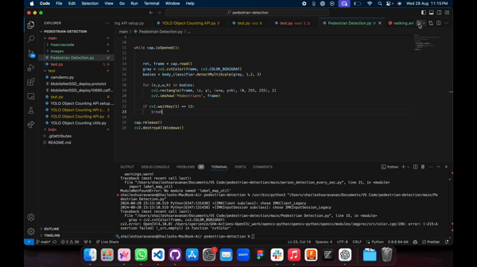

# Pedestrian Detection Project

## Overview
This project implements pedestrian detection using OpenCV and the Haar Cascade classifier. The objective is to detect pedestrians in images or video streams. The project is organized into three folders: `train`, `test`, and `main`. The final working script is located in the `main` folder and is named `Pedestrian Detection.py`.



## Project Structure
- **train/**: This folder contains the dataset used for training. It includes positive and negative images for training the Haar Cascade classifier.

- **test/**: This folder contains images or videos used to test the pedestrian detection model after training.

- **main/**: This folder contains the main script `Pedestrian Detection.py`, which is the entry point for the project. It uses the trained Haar Cascade model to detect pedestrians in the provided test images or video streams.

## Prerequisites
Before running the project, ensure you have the following dependencies installed:

- Python 3.x
- OpenCV (`cv2`)
- NumPy

You can install the required packages using pip:

```bash
pip install opencv-python-headless numpy
```

## Usage

### Training
1. Place your positive and negative training images in the `train` folder.
2. Train your Haar Cascade classifier using OpenCV.

### Testing
1. Place the images or videos you want to test in the `test` folder.

### Running the Main Script
1. Navigate to the `main` folder.
2. Run the `Pedestrian Detection.py` script:

```bash
python Pedestrian Detection.py
```

This script will load the Haar Cascade classifier and apply it to the images or videos in the `test` folder to detect pedestrians.

## Pedestrian Detection Script (`Pedestrian Detection.py`)
This script performs the following steps:

1. Loads the pre-trained Haar Cascade classifier for pedestrian detection.
2. Loads images or video streams from the `test` folder.
3. Applies the classifier to detect pedestrians.
4. Draws bounding boxes around detected pedestrians.
5. Displays the results or saves them to the `test` folder.

## Example
After running the script, you should see images or video frames with bounding boxes around detected pedestrians, which will be displayed on the screen or saved back to the `test` folder.

## Notes
- Make sure the Haar Cascade XML file is correctly referenced in the `Pedestrian Detection.py` script.
- The accuracy of detection depends on the quality of the training dataset and the Haar Cascade model.